# Execution Plan

## Detailed Analysis Summary

### Change Impact Assessment

| 項目 | 影響 | 内容 |
|---|---|---|
| User-facing changes | Yes | 新規アプリ全体がユーザー向け機能 |
| Structural changes | Yes | 新規アーキテクチャ（Next.js App Router + localStorage） |
| Data model changes | Yes | 作文データ構造（localStorage スキーマ設計が必要） |
| API changes | N/A | MVP はサーバー API なし（localStorage のみ） |
| NFR impact | Yes | パフォーマンス（LCP 2.5s）、SEO（SSR 必須）、セキュリティ（ヘッダー・入力バリデーション） |

### Risk Assessment

| 項目 | 評価 | 理由 |
|---|---|---|
| **Risk Level** | Medium | 縦書きレンダリングは技術的に非標準。タイムライン制約（4/4デモ）あり |
| **Rollback Complexity** | Easy | localStorage のみ・サーバーサイドデータなし |
| **Testing Complexity** | Moderate | 縦書きグリッドは視覚的テストが必要。印刷出力の精度検証も必要 |

---

## Workflow Visualization

### Mermaid Diagram

```mermaid
flowchart TD
    Start(["User Request"])

    subgraph INCEPTION["INCEPTION PHASE"]
        WD["Workspace Detection<br/><b>COMPLETED</b>"]
        RE["Reverse Engineering<br/><b>SKIPPED</b>"]
        RA["Requirements Analysis<br/><b>COMPLETED</b>"]
        US["User Stories<br/><b>EXECUTE</b>"]
        WP["Workflow Planning<br/><b>COMPLETED</b>"]
        AD["Application Design<br/><b>EXECUTE</b>"]
        UG["Units Generation<br/><b>EXECUTE</b>"]
    end

    subgraph CONSTRUCTION["CONSTRUCTION PHASE (per unit)"]
        FD["Functional Design<br/><b>EXECUTE</b>"]
        NFRA["NFR Requirements<br/><b>EXECUTE</b>"]
        NFRD["NFR Design<br/><b>EXECUTE</b>"]
        ID["Infrastructure Design<br/><b>EXECUTE</b>"]
        CG["Code Generation<br/><b>EXECUTE</b>"]
        BT["Build and Test<br/><b>EXECUTE</b>"]
    end

    subgraph OPERATIONS["OPERATIONS PHASE"]
        OPS["Operations<br/><b>PLACEHOLDER</b>"]
    end

    Start --> WD
    WD --> RE
    RE --> RA
    RA --> US
    US --> WP
    WP --> AD
    AD --> UG
    UG --> FD
    FD --> NFRA
    NFRA --> NFRD
    NFRD --> ID
    ID --> CG
    CG --> BT
    BT --> OPS
    OPS --> End(["Complete"])

    style WD fill:#4CAF50,stroke:#1B5E20,stroke-width:3px,color:#fff
    style RE fill:#BDBDBD,stroke:#424242,stroke-width:2px,stroke-dasharray: 5 5,color:#000
    style RA fill:#4CAF50,stroke:#1B5E20,stroke-width:3px,color:#fff
    style US fill:#FFA726,stroke:#E65100,stroke-width:3px,stroke-dasharray: 5 5,color:#000
    style WP fill:#4CAF50,stroke:#1B5E20,stroke-width:3px,color:#fff
    style AD fill:#FFA726,stroke:#E65100,stroke-width:3px,stroke-dasharray: 5 5,color:#000
    style UG fill:#FFA726,stroke:#E65100,stroke-width:3px,stroke-dasharray: 5 5,color:#000
    style FD fill:#FFA726,stroke:#E65100,stroke-width:3px,stroke-dasharray: 5 5,color:#000
    style NFRA fill:#FFA726,stroke:#E65100,stroke-width:3px,stroke-dasharray: 5 5,color:#000
    style NFRD fill:#FFA726,stroke:#E65100,stroke-width:3px,stroke-dasharray: 5 5,color:#000
    style ID fill:#FFA726,stroke:#E65100,stroke-width:3px,stroke-dasharray: 5 5,color:#000
    style CG fill:#4CAF50,stroke:#1B5E20,stroke-width:3px,color:#fff
    style BT fill:#4CAF50,stroke:#1B5E20,stroke-width:3px,color:#fff
    style OPS fill:#BDBDBD,stroke:#424242,stroke-width:2px,stroke-dasharray: 5 5,color:#000
    style Start fill:#CE93D8,stroke:#6A1B9A,stroke-width:3px,color:#000
    style End fill:#CE93D8,stroke:#6A1B9A,stroke-width:3px,color:#000

    linkStyle default stroke:#333,stroke-width:2px
```



### Text Alternative

```
INCEPTION PHASE:
  [DONE] Workspace Detection
  [SKIP] Reverse Engineering     - Greenfield プロジェクトのため不要
  [DONE] Requirements Analysis
  [EXEC] User Stories            - 複数ユーザータイプ・ユーザー向け機能
  [DONE] Workflow Planning
  [EXEC] Application Design      - 新規コンポーネント設計が必要
  [EXEC] Units Generation        - 複数ユニットへの分解が必要

CONSTRUCTION PHASE (ユニット毎に繰り返し):
  [EXEC] Functional Design       - 新規データモデル・複雑なビジネスロジック
  [EXEC] NFR Requirements        - パフォーマンス・SEO・セキュリティ要件あり
  [EXEC] NFR Design              - NFR Requirements 実行に伴い実施
  [EXEC] Infrastructure Design   - Vercel デプロイ設定・Next.js 構成
  [EXEC] Code Generation         - 実装（Plan + Generation の 2 部構成）
  [EXEC] Build and Test          - ビルド・テスト・検証

OPERATIONS PHASE:
  [HOLD] Operations              - 将来拡張（現在はプレースホルダー）
```

---

## Phases to Execute

### INCEPTION PHASE

- [x] Workspace Detection (COMPLETED)
- [x] Reverse Engineering (SKIPPED - Greenfield)
  - **Rationale**: 既存コードなし。Greenfield プロジェクトのため不要。
- [x] Requirements Analysis (COMPLETED)
- [ ] User Stories - EXECUTE
  - **Rationale**: 複数ユーザータイプ（児童・保護者）が存在。ユーザー向け機能。許容条件（acceptance criteria）の明確化が有用。
- [x] Workflow Planning (COMPLETED)
- [ ] Application Design - EXECUTE
  - **Rationale**: 縦書きグリッドコンポーネント・ヒント入力フロー・印刷エンジン等、新規コンポーネントの設計が必要。コンポーネント間依存関係の明確化が必要。
- [ ] Units Generation - EXECUTE
  - **Rationale**: 機能的に独立した複数ユニット（ヒントフロー・原稿用紙エンジン・SEO/インフラ等）への分解が必要。ユニット毎に Construction Phase を実行する。

### CONSTRUCTION PHASE

> 各ユニット毎に以下のステージを順番に実行する。ユニット数は Units Generation で確定。

- [ ] Functional Design - EXECUTE（per-unit）
  - **Rationale**: 作文データ構造（localStorage スキーマ）・縦書きレンダリングロジック・ヒント生成ロジック等、新規データモデルと複雑なビジネスルールの詳細設計が必要。
- [ ] NFR Requirements - EXECUTE（per-unit）
  - **Rationale**: パフォーマンス（LCP 2.5s）・SEO（SSR）・セキュリティ（SECURITY-04/05/09）の要件が明確に存在する。
- [ ] NFR Design - EXECUTE（per-unit）
  - **Rationale**: NFR Requirements を実行するため、NFR パターンの設計も必要。
- [ ] Infrastructure Design - EXECUTE（per-unit）
  - **Rationale**: Vercel デプロイ設定・Next.js 構成（SSR・sitemap・OGP）・GitHub Actions CI/CD の設計が必要。
- [ ] Code Generation - EXECUTE（per-unit、ALWAYS）
  - **Rationale**: コードの実装。Part 1（計画）→ Part 2（生成）の 2 部構成で実施。
- [ ] Build and Test - EXECUTE（ALWAYS）
  - **Rationale**: 全ユニット完了後にビルド・テスト・検証を実施。

### OPERATIONS PHASE

- [ ] Operations - PLACEHOLDER
  - **Rationale**: 将来の拡張フェーズ。現時点ではプレースホルダー。

---

## Priority Guidance（タイムライン制約）

4月4日のデモに向けて、以下の優先順で進める：

| Priority | 対象ユニット（目安） | 理由 |
|---|---|---|
| 最優先 | ヒント入力フロー + 原稿用紙エンジン（基本動作） | デモで「ヒント入力 → 原稿用紙」の流れが見せられれば十分 |
| 次優先 | 印刷機能 + 自動保存 | MVP として必須 |
| 最後 | SEO/AIO 対応・Vercel 本番デプロイ | 5/4 ローンチに向けて実施 |

---

## Success Criteria

| 指標 | 内容 |
|---|---|
| **Primary Goal** | 2026年8月に 1,000 人が 1 回以上利用 |
| **Phase 0 Goal** | 2026年4月4日 — 動くデモ（ヒント入力→原稿用紙表示） |
| **Phase 1 Goal** | 2026年5月4日 — 本番デプロイ・SEO対策済み |
| **Key Deliverables** | 縦書き原稿用紙UI・ヒントフロー・印刷機能・SEO最適化 |
| **Quality Gates** | LCP 2.5s 以内、印刷出力が A4 縦に正しく収まること、タブレット横向きレイアウトが崩れないこと |

---

## Extension Compliance Summary

| Extension | Status | Rationale |
|---|---|---|
| Security Baseline | Compliant | SECURITY-04/05/09 を適用。残はMVPスコープ外としてN/A処理済み（requirements.md 参照） |
